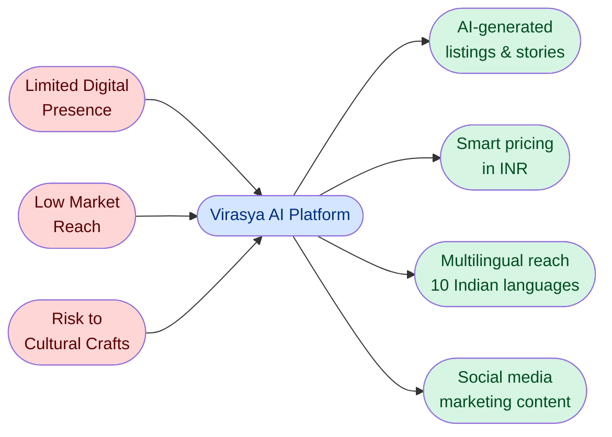
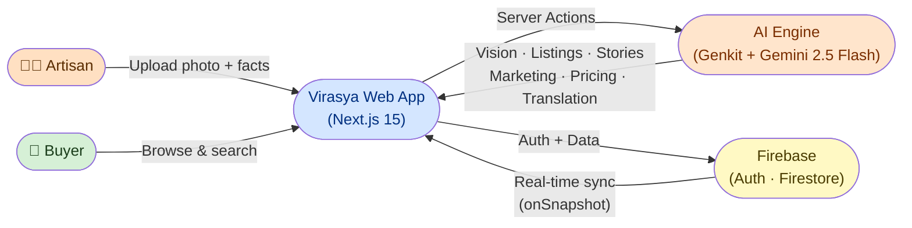
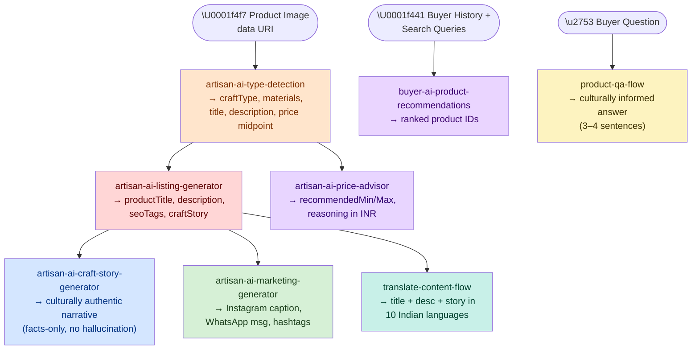
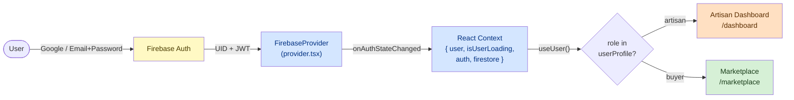
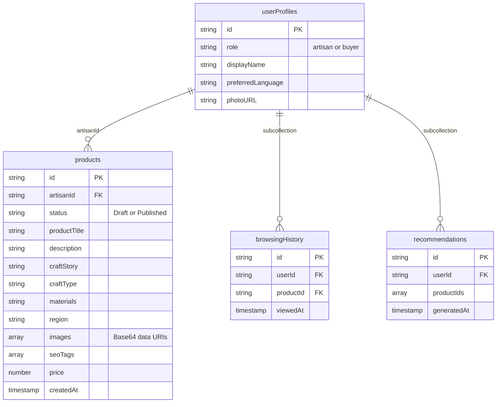

# Virasya `—` AI-Powered Heritage Marketplace

> **Smart Cataloging & Market Linkage for Marginalized Artisans** · [virasya.vercel.app](https://virasya.vercel.app/)

An AI-driven web platform that acts as a *virtual business manager* for Indian artisans. It automates product photography analysis, listing generation, pricing, multilingual content, and social media marketing.

---

## The Problem

India has millions of skilled artisans and micro-entrepreneurs supported through government schemes, Shilp Samagams, and trade fairs like Surajkund Mela and Dilli Haat. These events provide a temporary boost, but artisans have **no continuous, year-round digital channel**.

Three barriers block their transition to e-commerce:

- **No digital presence:** artisans lack the tools and knowledge to photograph, describe, and price products professionally for online platforms.
- **Low market reach:** crafts stay confined to local or seasonal fairs, with no access to national or global buyers.
- **Cultural erosion:** without sustainable income, many traditional art forms face decline and disappearance.

## The Solution

Virasya bridges traditional craftsmanship and modern digital commerce. Upload a photo and the AI does the rest.



---

## How It Works

Two user roles interact with a shared marketplace, each served a tailored experience:



**Artisan flow:** Upload image → Vision AI auto-detects craft type & materials → Artisan confirms → Genkit generates title, description, SEO tags, craft story, pricing range, and social media content → product saved as *Draft*, published when ready.

**Buyer flow:** Browse marketplace → AI-powered recommendations (based on browsing history & search queries) → ask product questions via AI Q&A → make purchases.

---

## Tech Stack

| Layer                | Technology                                           | Notes                                  |
| -------------------- | ---------------------------------------------------- | -------------------------------------- |
| **Frontend**   | Next.js 15 (App Router)                              | Turbopack dev server on port`9002`   |
| **UI**         | Tailwind CSS + ShadCN UI + Radix UI                  | Design tokens in`tailwind.config.ts` |
| **AI Engine**  | Google Genkit`^1.28` + `@genkit-ai/google-genai` | Gemini 2.5 Flash, server-side flows    |
| **Auth**       | Firebase Auth                                        | Google OAuth + Email/Password          |
| **Database**   | Firestore (real-time)                                | `onSnapshot`-driven hooks            |
| **Deployment** | Vercel (primary) / Firebase App Hosting              | `apphosting.yaml` included           |
| **Language**   | TypeScript 5 + Zod schemas                           | All AI I/O fully typed via Zod         |

---

## Project Structure

```
src/
├── ai/
│   ├── genkit.ts              # Genkit instance (model: gemini-3.6-flash)
│   ├── dev.ts                 # Imports all flows for the Genkit Dev UI
│   └── flows/                 # 8 Genkit flows — see AI Flows section below
│
├── app/                       # Next.js App Router
│   ├── page.tsx               # Landing page (hero, role selector)
│   ├── auth/                  # Sign-in / Sign-up (sets user role in Firestore)
│   ├── dashboard/             # Artisan dashboard + /upload (product creation wizard)
│   ├── marketplace/           # Public buyer marketplace (real-time Firestore)
│   ├── product/               # Product detail page + AI Q&A
│   └── purchases/             # Buyer purchase history
│
├── firebase/
│   ├── config.ts              # Firebase project config (swap for your own)
│   ├── index.ts               # initializeFirebase() — App Hosting-aware init
│   ├── provider.tsx           # FirebaseProvider context + all hooks
│   ├── firestore/
│   │   ├── use-collection.tsx # Real-time collection listener (onSnapshot)
│   │   └── use-doc.tsx        # Real-time document listener
│   ├── non-blocking-login.tsx # Fire-and-forget auth actions
│   ├── non-blocking-updates.tsx # Fire-and-forget Firestore writes
│   ├── errors.ts              # Firebase error code → human-readable messages
│   └── error-emitter.ts       # Global error event bus
│
├── components/
│   ├── ProductCard.tsx        # Marketplace card component
│   ├── FirebaseErrorListener.tsx # Toasts Firebase errors globally
│   ├── layout/                # Navbar, Footer, etc.
│   └── ui/                    # ShadCN-generated primitives
│
└── lib/                       # Shared utilities
```

---

## AI Flows (Genkit)

All flows live in `src/ai/flows/` and are **Next.js Server Actions** (`'use server'`). Each flow is an `ai.defineFlow()` wrapping an `ai.definePrompt()` with strict Zod schemas for I/O.



| Flow File                            | Trigger                  | Key Output                                                                                      |
| ------------------------------------ | ------------------------ | ----------------------------------------------------------------------------------------------- |
| `artisan-ai-type-detection`        | Photo upload             | `craftType` (enum), `suggestedTitle`, `suggestedMaterials`, `pricing.suggestedMidpoint` |
| `artisan-ai-listing-generator`     | Artisan confirms details | `productTitle`, `description` (150+ words), `seoTags[]`, `craftStory`                   |
| `artisan-ai-craft-story-generator` | Story-only regeneration  | Single`story` string (facts-only, no hallucination guarantee)                                 |
| `artisan-ai-price-advisor`         | Pricing step             | `recommendedMin`, `recommendedMax`, `reasoning`                                           |
| `artisan-ai-marketing-generator`   | Publish step             | `instagram`, `whatsapp` (25 words max), `hashtags[]`, `promoLine`                       |
| `translate-content-flow`           | Language selector        | `translatedTitle`, `translatedDescription`, `translatedStory`                             |
| `buyer-ai-product-recommendations` | Buyer opens marketplace  | `recommendedProductIds[]` (deduped, excludes viewed)                                          |
| `product-qa-flow`                  | Buyer asks question      | `answer` string (culturally grounded, 3–4 sentences)                                         |

**Translation languages supported:** Hindi · Tamil · Bengali · Marathi · English · Gujarati · Telugu · Kannada · Malayalam · Punjabi

**Anti-hallucination strategy:** The story and listing flows are explicitly instructed in their prompts to use *only* the artisan-provided `storyFacts` field and must not introduce invented personal or family history.

---

## Auth & Database

### Authentication

Firebase Auth handles identity. On first sign-in, a `userProfiles` document is created with a `role` field that gates the entire UI.



**Hooks exposed from `src/firebase/`:**

| Hook                     | Returns                                                   |
| ------------------------ | --------------------------------------------------------- |
| `useFirebase()`        | `{ firebaseApp, firestore, auth, user, isUserLoading }` |
| `useUser()`            | `{ user, isUserLoading, userError }`                    |
| `useAuth()`            | Firebase`Auth` instance                                 |
| `useFirestore()`       | Firestore instance                                        |
| `useCollection(query)` | Live array of docs (onSnapshot)                           |
| `useDoc(ref)`          | Live single document (onSnapshot)                         |

### Firestore Collections



### Security Rules Summary (`firestore.rules`)

| Collection                          | Read                                           | Write                               |
| ----------------------------------- | ---------------------------------------------- | ----------------------------------- |
| `/userProfiles/{userId}`          | Any signed-in user                             | Owner only (`auth.uid == userId`) |
| `/products/{productId}`           | Public if`status == Published`; owner always | Owner only via`artisanId` field   |
| `/users/{userId}/browsingHistory` | Owner only                                     | Owner only (path-scoped)            |
| `/users/{userId}/recommendations` | Owner only                                     | Owner only (path-scoped)            |

> **`artisanId` is immutable.** Update rules enforce `request.resource.data.artisanId == resource.data.artisanId`.

---

## Local Setup

> 📘 **For a detailed, step-by-step local setup guide, see [LOCAL_SETUP.md](file:///c:/Users/DELL/Downloads/GITHUB%20PROJECTS/SIH_virasya/LOCAL_SETUP.md).**

### Quick Start

1. **Clone & install**
   ```bash
   git clone https://github.com/archangel2006/SIH_virasya.git
   cd SIH_virasya
   npm install
   ```

2. **Environment Variables**
   Create a `.env` file at the root. **`GEMINI_API_KEY` is the only required variable for local development**:
   ```env
   GEMINI_API_KEY=your_google_ai_studio_key
   ```
   *(Firebase credentials come pre-configured with fallback development settings in `src/firebase/config.ts`).*

3. **Run Web App**
   ```bash
   npm run dev        # Next.js web application
   ```

4. **Run Genkit Dev UI (Optional for AI Flow Testing)**
   ```bash
   npm run genkit:dev # Genkit AI Flow UI at http://localhost:4000
   ```

---

## Genkit Dev UI

The Genkit Developer UI lets you inspect, test, and trace every AI flow in isolation, without touching the Next.js app. Useful when iterating on prompts or debugging AI outputs.

```bash
npm run genkit:dev      # Start Genkit UI (loads .env via dotenv)
npm run genkit:watch    # Same, with file-watching for hot reload
```

This runs `src/ai/dev.ts` which imports all 8 flows. The Genkit UI opens at **`http://localhost:4000`** where you can:

- Run any flow with custom inputs and view structured JSON outputs
- Inspect the full prompt text sent to Gemini (with rendered Handlebars)
- See token usage and latency per call
- Trace multi-step flows

**To add a new Genkit flow:**

1. Create `src/ai/flows/your-new-flow.ts` with input/output Zod schemas, a prompt, and a flow.
2. Import it in `src/ai/dev.ts` so the Dev UI registers it.
3. Export the callable function; mark the file `'use server'` for Next.js Server Actions.

---

## Deployment

### Vercel (Recommended)

1. Push to GitHub
2. Import repo in [Vercel](https://vercel.com) (auto-detects Next.js)
3. Add environment variable: `GEMINI_API_KEY`
4. Deploy Firestore rules separately via Firebase CLI

### Firebase App Hosting

`apphosting.yaml` is already configured. `initializeFirebase()` in `src/firebase/index.ts` first attempts a no-argument `initializeApp()` (which Firebase App Hosting populates automatically), then falls back to the `config.ts` object for local dev.

```bash
firebase deploy --only hosting
```

---

## Key Extension Points

| Want to...                     | Where to look                                                                                 |
| ------------------------------ | --------------------------------------------------------------------------------------------- |
| Add a new AI capability        | New file in`src/ai/flows/`, import in `dev.ts`, call via Server Action                    |
| Change the AI model            | `src/ai/genkit.ts`, swap `model: 'googleai/gemini-3.6-flash'`                             |
| Add a new Firestore collection | Add rules to`firestore.rules`, create hooks using `useCollection`/`useDoc`              |
| Add a new user role            | Extend`role` in `userProfiles`, add route guards in `app/`                              |
| Support more languages         | Extend the`targetLanguage` enum in `translate-content-flow.ts`                            |
| Replace Firestore              | Swap`src/firebase/firestore/` hooks (rest of app uses the hook interface)                   |
| Enable Genkit streaming        | Flows support`streamingCallback`, see [Genkit docs](https://firebase.google.com/docs/genkit) |

---

## Documentation

Deep-dives in `docs/`:

- `AUTHENTICATION.md` - Role-based Firebase Auth, dual-tab sign in/up, and password recovery
- `DATABASE.md`- Firestore schema details and real-time sync pattern
- `AI_INTEGRATIONS.md`- Genkit flow philosophy and implementation notes
- `DESIGN.md` Artisan-focused design language and color tokens
- `DEPLOYMENT.md`: Hosting alternatives and environment setup
- `INTEGRATIONS.md`- Third-party integration notes
- `blueprint.md`- Original feature blueprint
