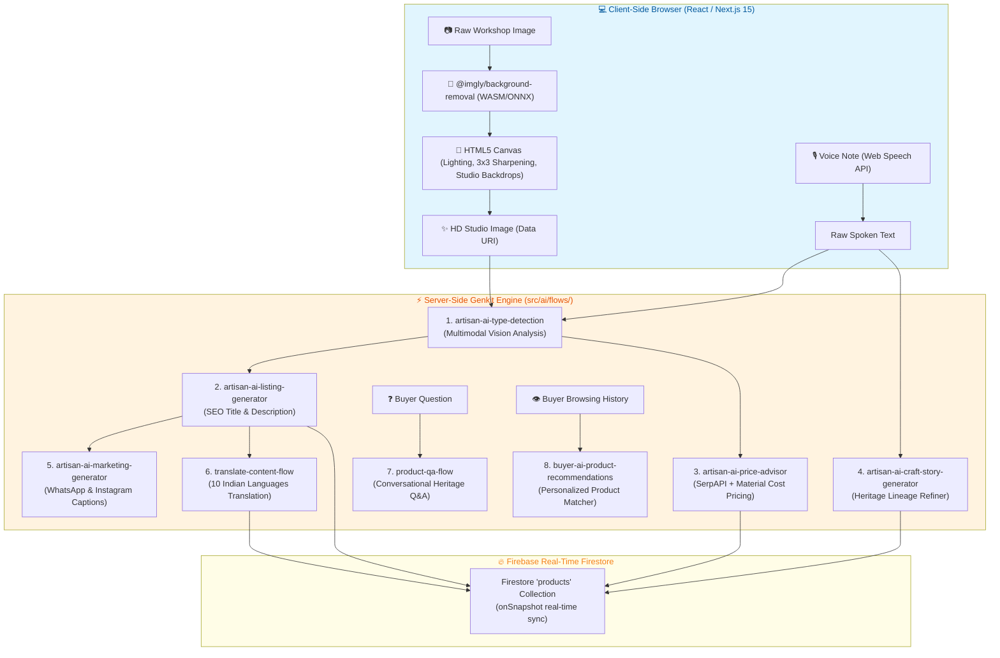

# Complete Genkit AI Flows & Architecture Overview

## 📌 Executive Summary

Virasya leverages a hybrid AI architecture split cleanly into two layers:
1. **Client-Side In-Browser AI Layer**: Runs `@imgly/background-removal` via WebAssembly (WASM) and ONNX neural network execution directly in the browser for instant, zero-cost image background removal, 3x3 convolution matrix sharpening, and lighting correction.
2. **Server-Side Genkit AI Engine**: Uses **Google Genkit (^1.28)** with **Gemini 2.5 Flash** (`googleai/gemini-2.5-flash`) via Next.js Server Actions (`'use server'`). All 8 AI flows use strict **Zod schemas** for input/output validation, guaranteeing structured JSON responses without hallucinations.

---

## 🏗️ End-to-End AI System Architecture



---

## 🔬 Summary of the 8 Server-Side Genkit Flows

All flows are defined in `src/ai/flows/` using `ai.defineFlow()` wrapping `ai.definePrompt()` with model `googleai/gemini-2.5-flash`.

| Flow Name | File Location | Input Parameters | Key Output (Strict Zod Schema) |
| :--- | :--- | :--- | :--- |
| **1. Type Detection (Vision)** | `src/ai/flows/artisan-ai-type-detection.ts` | `photoDataUri` (base64 string) | `craftType`, `materials` array, `initialTitle`, `initialDescription`, `estimatedPriceMidpoint` |
| **2. Listing Generator** | `src/ai/flows/artisan-ai-listing-generator.ts` | `craftType`, `materials`, `spokenText`, `photoDataUri` | `productTitle`, `description`, `seoTags`, `suggestedCategory` |
| **3. Price Advisor** | `src/ai/flows/artisan-ai-price-advisor.ts` | `craftType`, `materials`, `description`, `photoDataUri` | `recommendedMinINR`, `recommendedMaxINR`, `priceReasoning` |
| **4. Heritage Story Refiner** | `src/ai/flows/artisan-ai-craft-story-generator.ts` | `spokenText` (artisan lineage audio transcript), `craftType` | `craftStory` (Polished authentic family lineage narrative) |
| **5. Marketing Generator** | `src/ai/flows/artisan-ai-marketing-generator.ts` | `productTitle`, `description`, `craftStory` | `instagramCaption`, `whatsAppMessage`, `hashtags` |
| **6. Multilingual Translation** | `src/ai/flows/translate-content-flow.ts` | `title`, `description`, `craftStory`, `targetLanguage` | `translatedTitle`, `translatedDescription`, `translatedStory` |
| **7. Product Q&A** | `src/ai/flows/product-qa-flow.ts` | `productTitle`, `description`, `craftStory`, `userQuestion` | `answer` (Culturally context-aware buyer answer) |
| **8. Buyer Recommendations** | `src/ai/flows/buyer-ai-product-recommendations.ts` | `buyerHistory`, `searchQueries`, `availableProducts` | `recommendedProductIds` array (Ranked order) |

---

## 🛡️ Zod Schema Type Safety Example

Every Genkit flow enforces runtime validation. For example, `artisan-ai-type-detection.ts`:

```typescript
import { z } from 'zod';
import { ai } from '../genkit';

export const VisionAnalysisInputSchema = z.object({
  photoDataUri: z.string().describe('Base64 data URI of the craft image'),
});

export const VisionAnalysisOutputSchema = z.object({
  craftType: z.string().describe('Detected craft category, e.g. Terracotta Pottery, Handloom Silk'),
  materials: z.array(z.string()).describe('Materials visible in the image'),
  initialTitle: z.string().describe('Suggested 3 to 5 word title'),
  initialDescription: z.string().describe('1-sentence physical summary'),
  estimatedPriceMidpoint: z.number().describe('Initial price estimate in INR'),
});

export const typeDetectionFlow = ai.defineFlow(
  {
    name: 'typeDetectionFlow',
    inputSchema: VisionAnalysisInputSchema,
    outputSchema: VisionAnalysisOutputSchema,
  },
  async (input) => {
    // Calls Gemini 2.5 Flash with structured output schema
  }
);
```

---

## ⚡ Client-Side WASM vs Server-Side Genkit Execution Comparison

| Aspect | Client-Side Image Enhancer | Server-Side Genkit AI Engine |
| :--- | :--- | :--- |
| **Technology** | WebAssembly (WASM), ONNX, HTML5 Canvas API | Google Genkit SDK (`gemini-2.5-flash`) |
| **Library** | `@imgly/background-removal` | `@genkit-ai/google-genai` |
| **Where Executed** | In-Browser (Client device) | Next.js Server Actions (Edge / Node server) |
| **API Key Needed?** | ❌ **No (100% Free, Local)** | ✅ Yes (`GEMINI_API_KEY`) |
| **Purpose** | Background removal, 3x3 sharpening, lighting balance | Vision analysis, catalog text, price advice, story refining |

---

## 📄 Key File References

- **Genkit Configuration:** [`src/ai/genkit.ts`](file:///c:/Users/DELL/Downloads/GITHUB%20PROJECTS/SIH_virasya/src/ai/genkit.ts)
- **Genkit Flow Directory:** [`src/ai/flows/`](file:///c:/Users/DELL/Downloads/GITHUB%20PROJECTS/SIH_virasya/src/ai/flows/)
- **Client AI Enhancer Component:** [`src/components/ImageEnhancerStudio.tsx`](file:///c:/Users/DELL/Downloads/GITHUB%20PROJECTS/SIH_virasya/src/components/ImageEnhancerStudio.tsx)
- **Genkit Integration in Upload Page:** [`src/app/dashboard/upload/page.tsx`](file:///c:/Users/DELL/Downloads/GITHUB%20PROJECTS/SIH_virasya/src/app/dashboard/upload/page.tsx)
